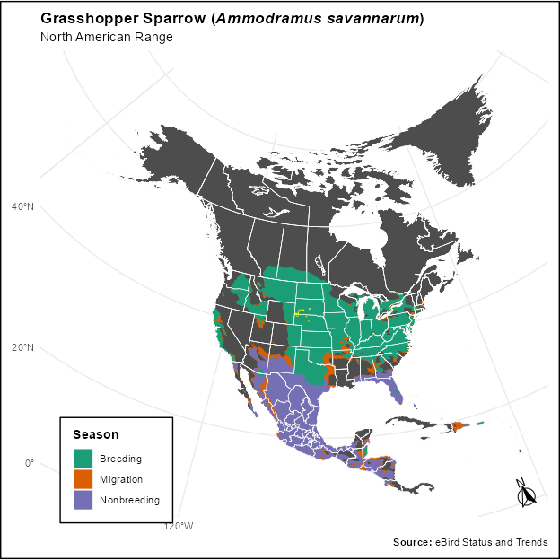

::: {.cell}

:::

:::{custom-style="Body Text"}
# Grasshopper Sparrow (*Ammodramus savannarum*)

## Species observation records and conservation categories

### What, if any, are the scientific name synonyms for the species

::: {.cell}

:::

There are no known synonyms for this species {GBIF Secretariat 2023}.
**[SPECIALISTS REVIEW USDA PLANTS AND OTHER LITERATURE FOR MORE SPECIES.]**

### NatureServe Conservation Status (Global/State):

G5/S4(NE), S4B(SD)

### Additional Qualifying Conservation Categories (including Local Concern)

::: {.cell}

:::

Region 2 Sensitive Species.

### Number of Occurrence records by Data Source

::: {.cell}

:::

Observations: GFIB - 413, iDigBio - 1, Bird Conservancy of the Rockies - 6299.

#### Year of first observation for the combined data: 

1987

#### Year of last observation for the combined data: 

NA

### Is the species currently federally designated as threatened, endangered, proposed, or candidate speecies under the Endangered Species Act?

::: {.cell}

:::

No

### Species' Native Range 

::: {.cell}

:::

:::

:::{custom-style="Caption"}

::: {.cell}

:::

::: {.cell}
::: {.cell-output-display}
{#fig-breeding-range fig-alt='North American Seasonal Ranges'}
:::
:::

:::
:::{custom-style="Caption"}

::: {.cell}
::: {.cell-output-display}
{fig-alt='North American Seasonal Ranges'}
:::
:::

:::
:::{custom-style="Body Text"}

### Is the species native and known to occur?

::: {.cell}

:::

Yes

#### Justification for ‘no’:

## Species information

### Species Current Range Size and Configuration

#### What is the size of the species' range?

[Large, Moderate, Regional Endemic, State Endemic, Local Endemic – refer to process paper for category definitions]

#### Is the portion of the species range that overlaps the plan area disjunct from the main range of the species (i.e., the range overlapping the plan area is smaller and not connected to the larger range of the species)?

[Yes, No, Unknown]

#### Based on the species’ ecology and the environmental conditions present, does the plan area overlap the edge of the species range?

[Yes, No, Unknown]

### Species’ Landscape-scale Habitat

#### What are the landscape-scale habitat types or ecosystems the species occupies based on Best Available Scientific Information (BASI), inside and out of the plan area. 

[Narrative description pulled in from NatureServe– will need manual review to ensure fine-scale habitat features are not mixed in with landscape, and additional BASI as appropriate; NatureServe also doesn’t capture many plants, so this may also need to be written manually]

#### Based on BASI , what are the landscape-scale habitat types or ecosystems in the plan area are likely to support the species?

[Checklist of categories from Ecology Group pulled in from spreadsheet – this will get pulled in automatically from Mike’s NatureServe pull + crosswalk, but will still require manual review for accuracy (especially for the plantation category)]

#### Macrohabitat Availability and Distribution

[See Appendix.]

#### Species Response to Macrohabitat Threats and Trends

[Intent of this section is to tier to the Appendix, but bring in any species-specific info about how the species responds to general habitat trends/threats. The appendix explains the macrohabitat availability, distribution, and threats, but this is where you would connect it to the species- e.g., if fire is a threat, but species actually needs fire for its seeds to germinate, or it actually uses roadside habitat so road development is not as much of a threat].

:::

