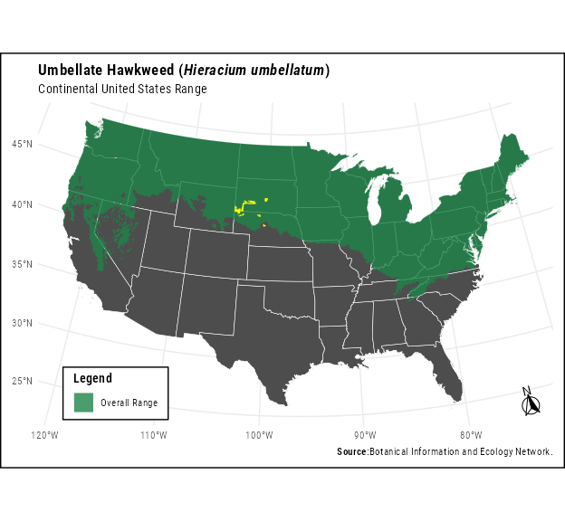
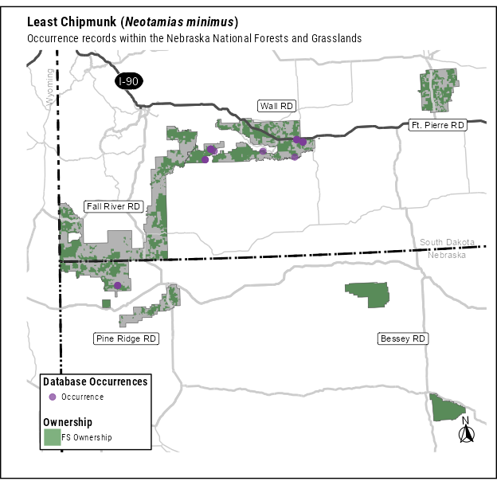

::: {.cell}

:::

:::{custom-style="Body Text"}
# Poison Suckleya (*Suckleya suckleyana*)

## Species occurrence records and conservation categories

### What, if any, are the scientific name synonyms for the species?

::: {.cell}

:::

Current and historic synonyms for *Suckleya suckleyana* are: *Atriplex suckleyana, Obione suckleyana, Suckleya petiolaris, Suckleyi suckleyana* {GBIF Secretariat 2023}.

### NatureServe Conservation Status (Global/State):

G5/S1(NE), NA(SD)

### Additional Qualifying Conservation Categories (including Local Concern)

::: {.cell}

:::

Nebraska SWAP Tier 2.

### Number of Occurrence Records by Data Source

::: {.cell}

:::

Occurrence: GBIF - 1, iDigBio - 2, SEINet - 3, Nebraska Natural Heritage - 1.

#### Year of first and last observation for all occurrence data: 

First: 1995, Last: NA

### Is the species currently federally designated as threatened, endangered, proposed, or candidate species under the Endangered Species Act?

::: {.cell}

:::

No

### Species' Native Range 

::: {.cell}

:::

:::

:::{custom-style="Caption"}

::: {.cell}
::: {.cell-output-display}
{fig-alt='Species range within the continental United States'}
:::
:::

::: {.cell}

:::

::: {.cell}

:::

::: {.cell}

:::

::: {.cell}

:::

:::
<!--Remove Caption-->
:::{custom-style="Caption"}

::: {.cell}
::: {.cell-output-display}
{fig-alt='North American Seasonal Ranges'}
:::
:::

:::
:::{custom-style="Body Text"}

### Is the species native and known to occur?

::: {.cell}

:::

Yes

[Add the following heading if a justification for no is necessary: Justification for ‘no’:]

## Species information

### Species Current Range Size and Configuration

#### What is the size of the species' range?

[Large, Moderate, Regional Endemic, State Endemic, Local Endemic – refer to process paper for category definitions]

#### Is the portion of the species range that overlaps the plan area disjunct from the main range of the species (i.e., the range overlapping the plan area is smaller and not connected to the larger range of the species)?

[Yes, No, Unknown]

#### What is the distance between the plan area and the closest edge of the species range? 
[unknown (i.e., no known range for the species), 0 miles (i.e. species range transects the plan area), 1-50 miles, 51-150 miles, 151-500 miles, 500 or more miles.]   

### Species’ Landscape-scale Habitat

#### What are the landscape-scale habitat types or ecosystems the species occupies based on Best Available Scientific Information (BASI), including literature from outside of the plan area?

::: {.cell}

:::

NA

[NARRATIVE DESCRIPTION PULLED IN FROM NATURESERVE– WILL NEED MANUAL REVIEW TO ENSURE FINE-SCALE HABITAT FEATURES ARE NOT MIXED IN WITH LANDSCAPE, AND ADDITIONAL BASI AS APPROPRIATE; NATURESERVE ALSO DOESN’T CAPTURE MANY PLANTS, SO THIS MAY ALSO NEED TO BE WRITTEN MANUALLY]

#### Based on BASI about the landscape-scale habitat types or ecosystems the species occupies, what landscape-scale habitat types or ecosystems in the plan area are likely to support the species?

::: {.cell}

:::

THERE ARE NO HABITAT TYPES AVAILABLE FOR THIS SPECIES FROM NATURSERVE THAT CROSSWALK TO DEFINED ECOSYSTEMS. 

[CHECKLIST OF CATEGORIES FROM ECOLOGY GROUP PULLED IN FROM SPREADSHEET – THIS WILL GET PULLED IN AUTOMATICALLY FROM MIKE’S NATURESERVE PULL + CROSSWALK, BUT WILL STILL REQUIRE MANUAL REVIEW FOR ACCURACY (ESPECIALLY FOR THE PLANTATION CATEGORY)]

#### Landscape-scale Habitat Availability and Distribution 

[DESCRIBE WITH ONE SENTENCE (AVAILABILITY: UNKNOWN, SCARCE, COMMON, ABUNDANT; DISTRIBUTION: UNKNOWN, ISOLATED PATCH, CLUMPED PATCHES, DISPERSED PATCHES, CONTIGUOUS) AND TIER TO APPENDIX. EXAMPLE: RIVERINE HABITAT IN THE PLAN AREA/ IS SCARCE AND IN DISPERSED PATCHES (SEE APPENDIX).]

#### Species Response to Landscape-scale Habitat Threats and Trends 

[Default: All threats and trends shown in the Appendix for this species’ macrohabitat are assumed to translate directly to this species.

MANUALLY REVIEW AND BRING IN ANY SPECIES-SPECIFIC INFO ABOUT HOW THE SPECIES RESPONDS TO GENERAL HABITAT TRENDS/THREATS. THE APPENDIX EXPLAINS THE MACROHABITAT AVAILABILITY, DISTRIBUTION, AND THREATS, BUT THIS IS WHERE YOU WOULD CONNECT IT TO THE SPECIES- E.G., IF FIRE IS A THREAT, BUT SPECIES ACTUALLY NEEDS FIRE FOR ITS SEEDS TO GERMINATE, OR IT ACTUALLY USES ROADSIDE HABITAT SO ROAD DEVELOPMENT IS NOT AS MUCH OF A THREAT].

### Species Fine-scale Habitat

#### What are the fine-scale habitat types or ecosystems the species occupies based on BASI, including literature from outside of the plan area?

[NARRATIVE DESCRIPTION FROM LITERATURE. TO HELP FOCUS THE EVALUATION ON ISSUES THAT ARE LIKELY TO AFFECT A SPECIES LONG-TERM PERSISTENCE THE INCLUSION OF FINE-SCALE HABITAT CONDITIONS OR FEATURES HERE, SHOULD BE LIMITED TO CONSIDERATION OF CONDITIONS OR FEATURES THAT: 1) BASI INDICATES ARE LIMITED IN ABUNDANCE OR DISTRIBUTION, 2) BASI SUGGEST ARE DECLINING IN ABUNDANCE OR DISTRIBUTION, OR 3) BASI INDICATES HAVE A DISPROPORTIONATE VALUE TO THE POPULATION DYNAMICS AND DISTRIBUTION OF THE SPECIES BECAUSE OF THE SPECIES SPECIALIZED ASSOCIATION WITH THE FEATURE OR LIFE HISTORY DEPENDENCE (E.G., RARE NESTING SUBSTRATE, RARE SOIL TYPE, COLD WATER REFUGIA).]

#### Fine-scale habitat availability and distribution

[FOR MANY SPECIES THIS WILL BE UNKNOWN, BUT THIS IS WHERE YOU COULD PUT INFO ON IF CERTAIN MICROHABITAT COMPONENTS ARE LIMITED IN THE PLAN AREA, SUCH AS SNAGS OR COLDWATER REFUGIA, ETC.]

#### Fine-scale habitat threats and trends 

[BUT PROVIDE NARRATIVE DISCUSSING SPECIES-SPECIFIC INFORMATION]

### Population 

#### Abundance and distribution

::: {.cell}

:::

[Default: There are no known population estimates for the species in the plan area. BIRD TRENDS? PULL IN INFORMATION FROM SPECIES RECORDS, LITERATURE, REPORTS, SPECIES DISTRIBUTION MODELS, ETC.]

#### Threats and trends 

[Default: There are no known specific population trends for the species in the plan area. Beyond threats documented across the species range {CITATIONS}, there are no known unique threats to the species within the plan area.]

### Natural and Life History Characteristics that Inform Species Persistence 

#### Dispersal ability

[BRIEF, ~ ONE SENTENCE DESCRIPTION OF SPECIES’ MOVEMENT SCALE AND ITS OVERALL DISPERSAL CAPACITY]

#### Life history strategy

[BRIEF, ~ ONE SENTENCE DESCRIPTION OF SPECIES’ LIFE HISTORY, RECOGNIZING SPECIES GENERALLY FIT ONE OF THESE CATEGORIES (EQUIVALENT IS ANNUAL/PERENNIAL FOR PLANTS): SLOW: LARGE BODY SIZE, LONG GENERATION, HIGH SURVIVAL, LOW REPRODUCTIVE INVESTMENT; FAST: SMALL BODY SIZE, SHORT GENERATION, LOW SURVIVAL, HIGH REPRODUCTIVE INVESTMENT] 

#### Ecological specialization 

[HABITAT OR SUBSTRATE SPECIALIST, DIETARY SPECIALIST, SYMBIOTIC (MUTUALISTIC, PARASITIC, OR COMMENSAL)]

#### Other factors

[Default: Unknown but review literature for things like: Inbreeding/Drift/Outbreeding/Hybridization/Density Dependence/Allee Effects]

## Specialist Recommendation:

### Sufficiency of BASI  

[LOW INFORMATION/MEDIUM INFORMATION/HIGH INFORMATION] 

### MPSG Specialist Recommendation   

[LIKELY TO BE OF CONCERN/NOT LIKELY TO BE OF CONCERN] 

### Rationale 

[SHORT NARRATIVE – SEE: DETERMINATION RATIONAL SUPPORT.XLSX]

## References

:::

